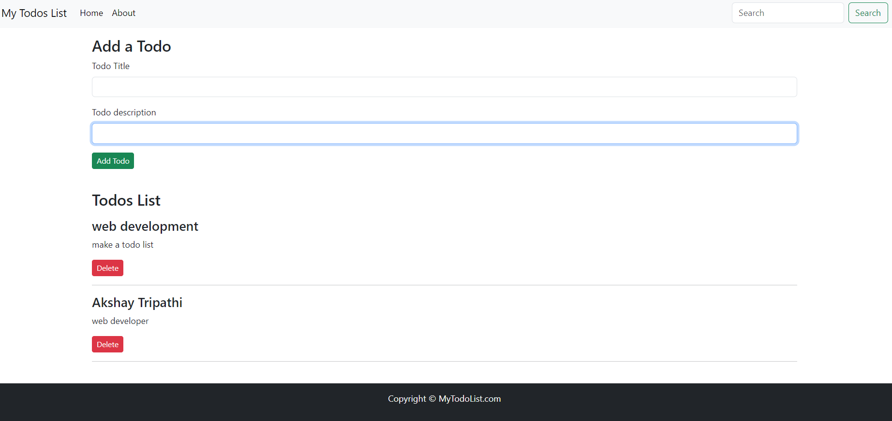

# Todo List App

Todo List App is a simple web application built using React. It allows users to manage their todo tasks, including adding new tasks, marking tasks as completed, and deleting tasks.




## Features

- Add new todo tasks with a title and description.
- View a list of all todo tasks.
- Delete todo tasks.
- Save todo tasks in local storage for persistence across sessions.


## Technologies Used

- React
- React Router
- HTML
- CSS

## Project Structure

The project consists of the following components:

- **Header**: Displays the title of the application.
- **AddTodo**: Component for adding new todo tasks.
- **Todos**: Component for displaying a list of todo tasks.
- **Footer**: Displays the footer of the application.
- **About**: Information about the application.

## Installation

1. Clone the repository to your local machine:

```
git clone https://github.com/AkshayTripathi0331/todo-list-app.git
```

2. Navigate to the project directory:

```
cd todo-list-app
```

3. Install dependencies:

```
npm install
```

4. Start the development server:

```
npm start
```

5. Open your web browser and navigate to `http://localhost:3000` to view the application.

## Usage

- Add a new todo task by entering the title and description in the AddTodo section and clicking the "Add" button.
- View all todo tasks in the Todos section.
- Mark a todo task as completed by clicking the checkbox next to it.
- Delete a todo task by clicking the delete button next to it.

## Live Demo

A live demo of the project is hosted on GitHub Pages: [Todo List App Demo](https://todolist-qbdw.onrender.com/)

